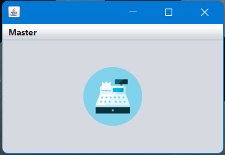
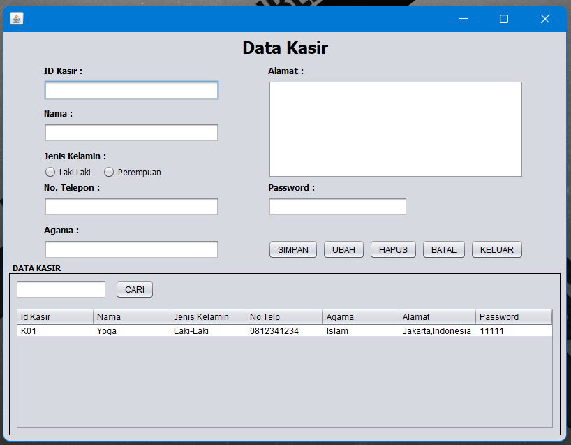
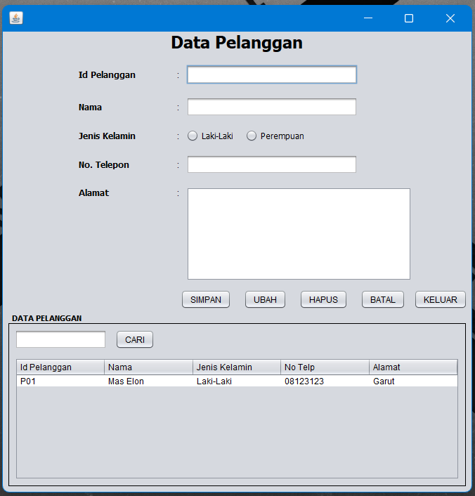
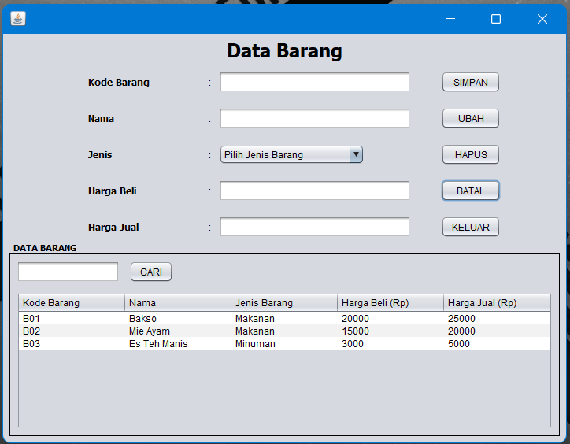

# Program Kasir
**Berikut program kasir yang hanya berisikan master kasir dan pelanggan menggunakan Netbeans IDE:**   
1.Menu Utama  
</img> 
2.Menu Kasir 
</img> 
3.Menu Pelanggan 
</img> 
4.Menu Barang 
</img> 
